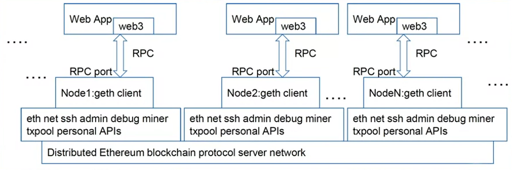

# Decentralized Applications (Dapps)

## Week 1 - Decentralized Applications

Learning Objectives

* Explain the high level architecture of a Dapp
* Explain at a high level the access from a web client to the blockchain server
* List a few Ethereum APIs that facilitate Dapp development
* Explain the functions and usage details of various APIs

### Blockchain Server

Decentralized applications or DApps,
open up the features and services of the blockchain to the whole world for
review, interaction, and enjoyment. DApp gives access to people,
applications and systems, not necessarily known to each
other to transact peer to peer. DApp is an end to end
application on a blockchain.

A DApp or a decentralized application
depends on the functionality of a blockchain for
its infrastructure and operations. In its simplest form, a DApp has
a client interface as a front-end, and a back-end that includes a blockchain and
a smart contract.

e prepared to chart your path through the emerging
decentralized software culture. A DApp or a decentralized application
depends on the functionality of a blockchain for
its infrastructure and operations. In its simplest form, a DApp has
a client interface as a front-end, and a back-end that includes a blockchain and
a smart contract. Consider, for example,
a simple wallet application client, and the Bitcoin blockchain
decentralized infrastructure. This is similar to the architecture
of a web browser and a web server, but
with one significant difference. The blockchain enables
a decentralized infrastructure.

Dapp Stack

* Verticals - end user applications
* Application framework - smart contract
* Ethereum blockchain and EVM
* Peer to peer networking and operating systens
* Hardware

Linkage

* https://www.coindesk.com/information/what-is-the-difference-blockchain-and-database/
* https://www.youtube.com/watch?v=gjwr-7PgpN8&t=10s
* https://www.youtube.com/watch?v=WSN5BaCzsbo&t=5s
* https://www.cryptocompare.com/coins/guides/what-is-and-how-to-use-the-ens/
* https://www.npmjs.com/package/ethereum-ens

### Daap Defined

What is a Dapp? A Dapp, or decentralized application,
solves a problem that requires blockchain services and blockchain
infrastructure for realizing its purpose.

If you are programmatically assembling
the Dapp without the help of any development involvement, you copy
the web3 deploy script into your app, say an HTML JavaScript file as a script. Deploy the smart contract using
the functions in the script. And invoke the smart contract function
using the functions in the script, and the ABI, and
the smart contract address.

web app - use web3 js module for json/rpc interaction with eth rpc port/node

Linkage:

* https://blockchainhub.net/decentralized-applications-dapps/
* https://www.youtube.com/watch?v=97ufCT6lQcY
* https://www.freecodecamp.org/news/how-to-transfer-funds-on-the-ethereum-network-using-the-geth-cli-b7eac16aa3a9/

### EThereum APIs

Management APIs

* includes admin, debug, miner, personal, and txpool 
    * admin.addPeer()
    * debug.dumpBlock(16)
    * miner.start()
    * personal.newAccount()
    * txpool.inspect()
* support methods for management of the geth node

Web 3 APIs

* whisper api - web3.ssh
* javascript api
* smart contract deployment

Web 3 Arch

Linkage

* Plasma - historical - https://ethereum.org/en/developers/docs/scaling/plasma/
* https://cointelegraph.com/news/worlds-first-dapi-decentralized-application-programming-interface
* https://web3js.readthedocs.io/en/v1.2.9/
* https://gavofyork.gitbooks.io/turboethereum/content/cli_tools.html
